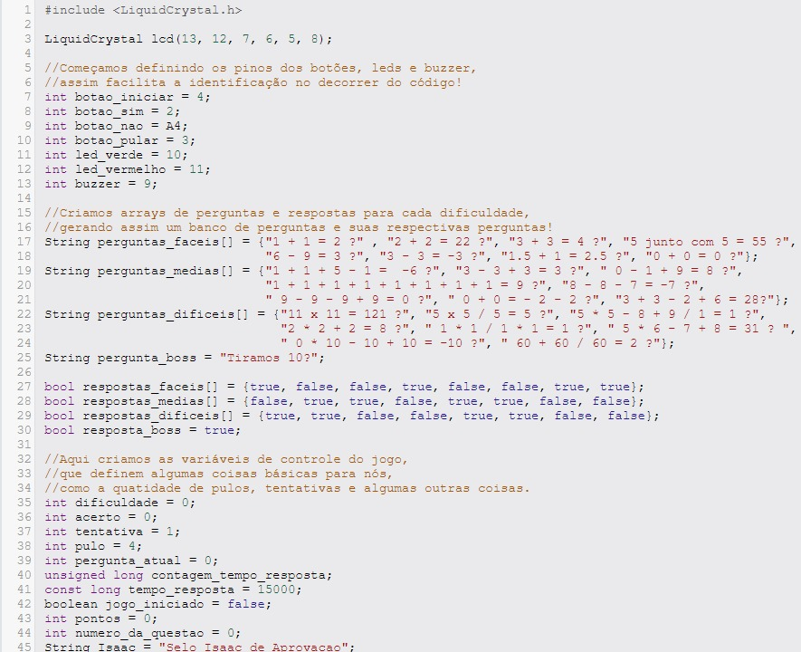
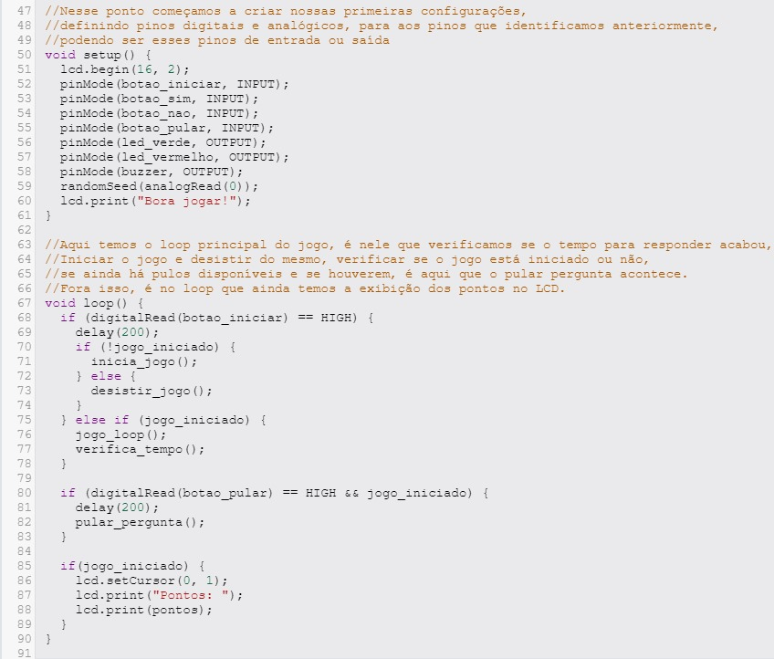
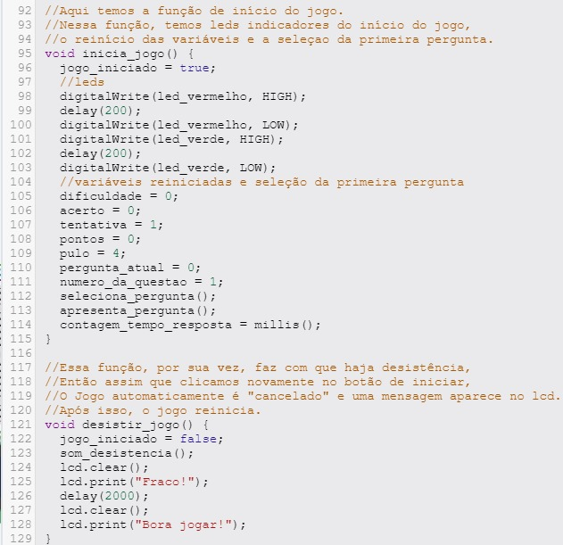
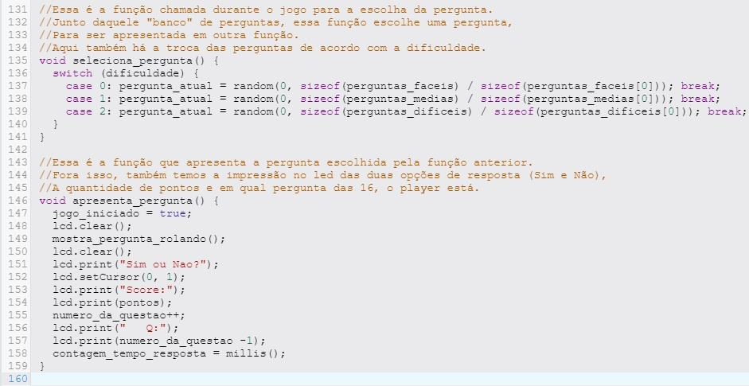
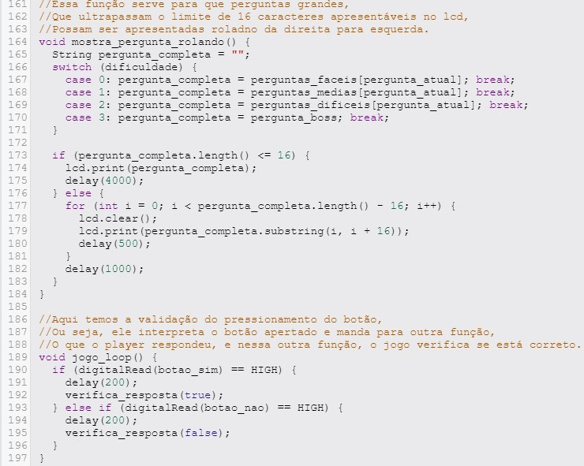
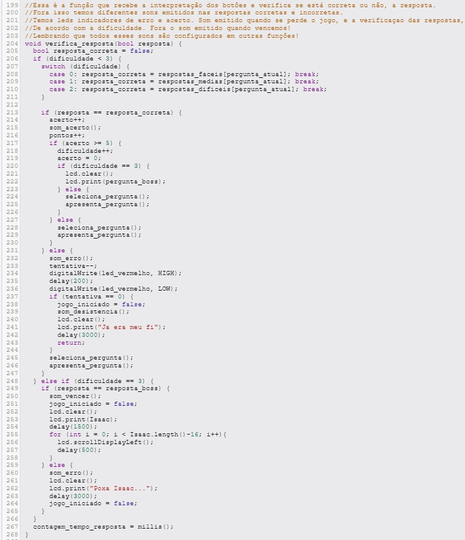
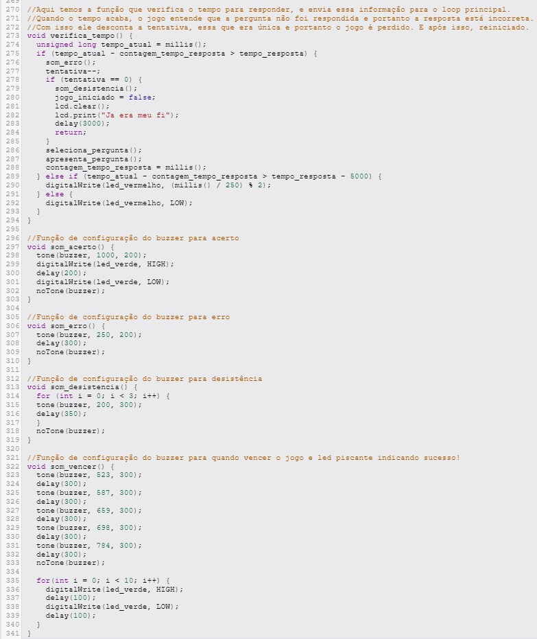
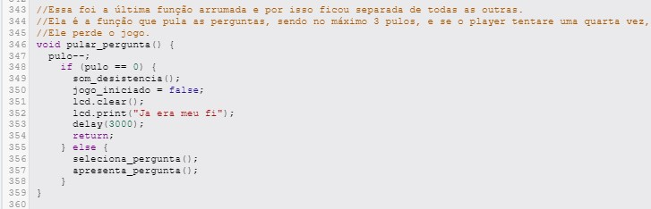

# 💡 Jogo de Perguntas com Arduino 💡

Este projeto consiste em um jogo de perguntas implementado utilizando Arduino. O jogo tem como objetivo proporcionar entretenimento e aprendizado ao mesmo tempo, desafiando os jogadores com questões de diferentes níveis de dificuldade.

## 📈 Objetivo 📈

O objetivo do jogo de perguntas é oferecer uma experiência divertida e educativa aos jogadores, enquanto exploram seus conhecimentos em diversos temas. Com três níveis de dificuldade - fácil, médio e difícil - cada um com cinco perguntas e uma pergunta final, os jogadores têm a oportunidade de testar suas habilidades e aprender novos conceitos.

## 📚 Metodologia 📚

### Materiais Utilizados

- 01 Arduino UNO
- 02 LEDs
- 04 botões
- 07 Resistores
- 01 Buzzer
- 01 Display LCD 16x2
- 02 Protoboards
- 01 Potenciômetro 

### Código Comentado

 

### Projeto no Tinkercad
